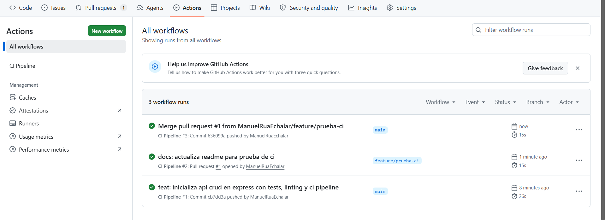
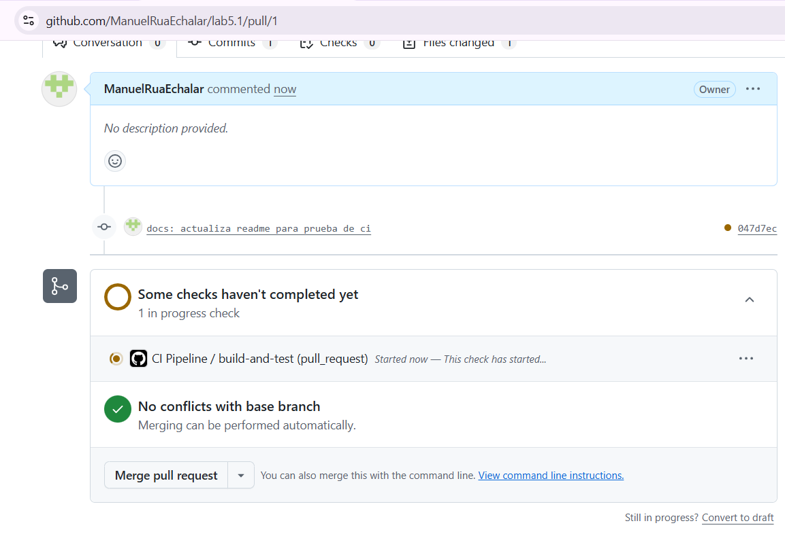
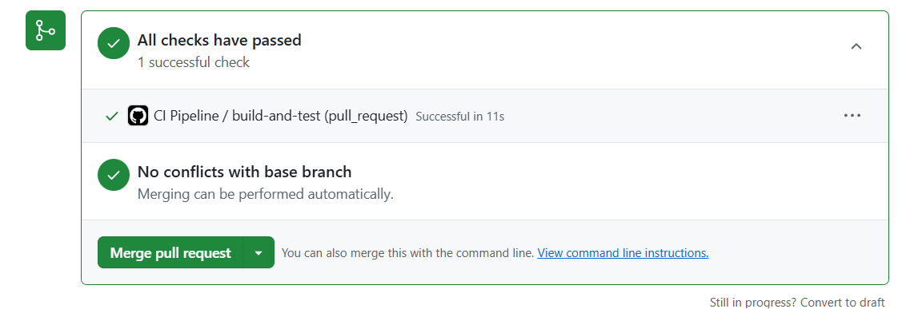
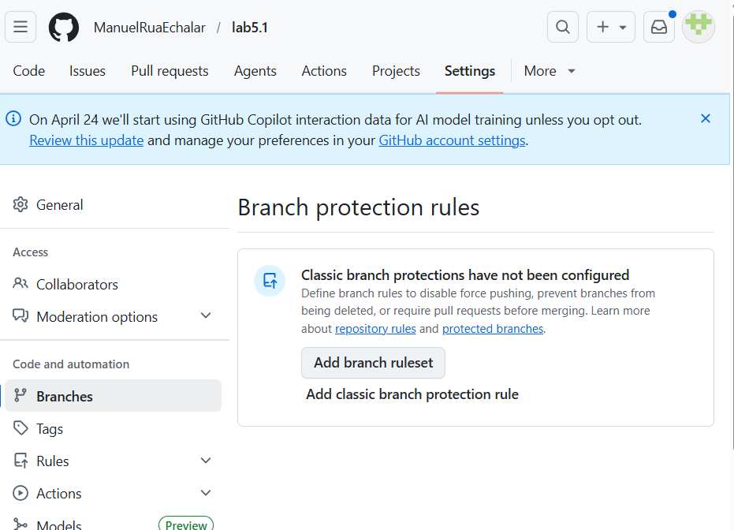
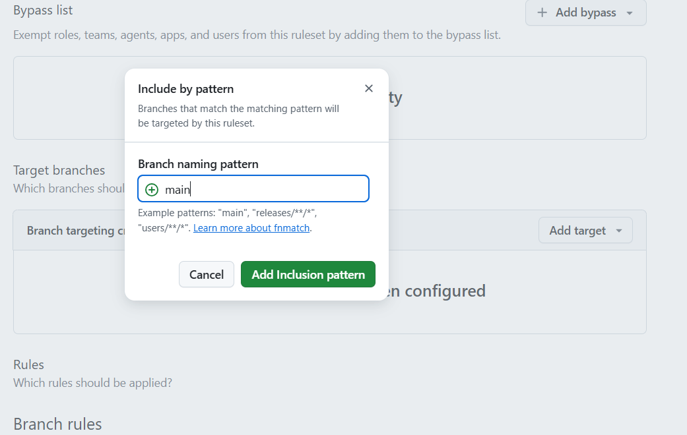
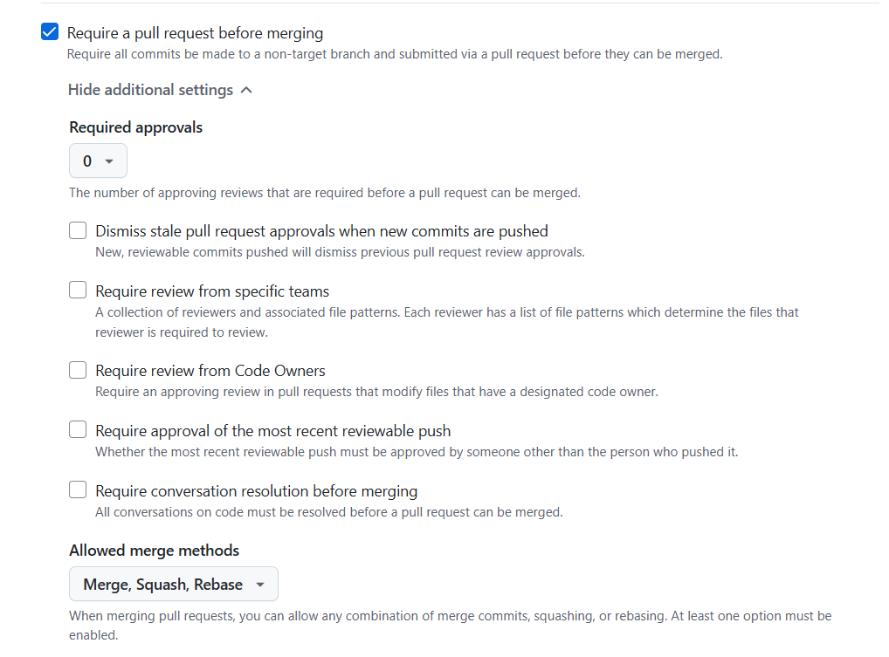
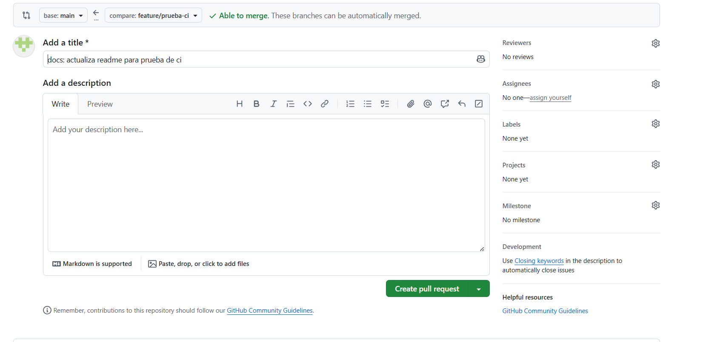
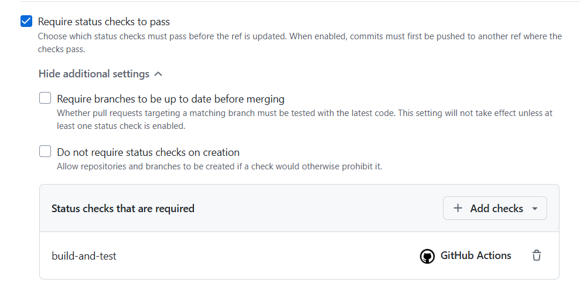
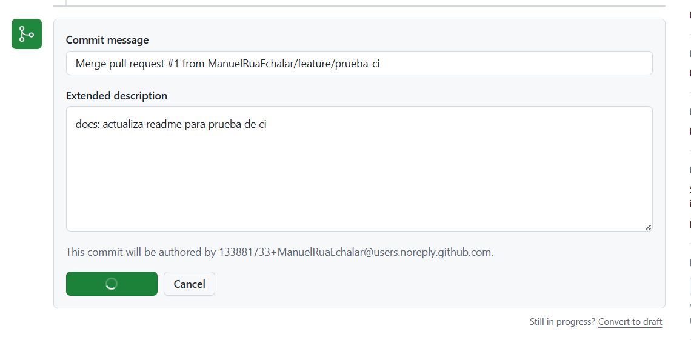
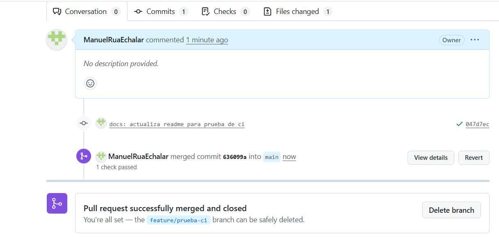

# Informe del Laboratorio 5.1: Workflow de GitHub Actions para CI

**Estudiante:** Juan Manuel Rua Echalar  
**Carrera:** Ing. Ciencias de la Computación

## Descripción del Proyecto y Pipeline Configurado

En esta práctica, se ha desarrollado una API RESTful sencilla utilizando **Express.js**, implementando un CRUD para la entidad `User`. Se incluyeron pruebas unitarias y de integración utilizando `Jest` y `Supertest` para garantizar que todas las rutas funcionen según lo esperado y tengan buena cobertura. Además, se ha configurado `ESLint` para el análisis estático de código.

El pipeline configurado en GitHub Actions (`.github/workflows/ci.yml`) consta de los siguientes pasos automatizados que se disparan en los eventos de `push` y `pull_request` a la rama `main`:
1. **Checkout del código:** Utiliza `actions/checkout` para descargar el repositorio.
2. **Setup de Node.js:** Se establece la versión de Node.js en la 20.x usando `actions/setup-node`.
3. **Instalación de dependencias:** Se ejecuta `npm ci` para instalar exactamente las versiones del `package-lock.json`.
4. **Análisis estático (Linting):** Ejecuta `npm run lint` para validar la sintaxis y estilo del código con ESLint.
5. **Ejecución de pruebas y cobertura:** Corre la suite de tests unitarios y de integración generando un reporte de cobertura mediante `npm test` (que ejecuta `jest --coverage`).

## Capturas de Pantalla y Evidencias

A continuación se presentan las capturas de pantalla que comprueban la correcta ejecución de cada paso:

### 1. Historial de Ejecuciones en Actions
Muestra el historial de ejecuciones registradas en la pestaña de Actions.

### 2. Detalle de Workflow Exitoso con Cobertura
Evidencia del pipeline corriendo y pasando de manera exitosa los checks configurados.

### 3. Configuración de Protección de Rama
Detalla cómo se ha configurado la regla de protección para la rama `main`.

### 4. Proceso de Pull Request y Merge
Muestra el proceso en acción de abrir un Pull Request, la validación del CI y el merge final.

## Conclusión

La configuración de Integración Continua (CI) resulta de suma importancia porque nos permite tener la certeza de que el código que estamos a punto de integrar a nuestra rama principal (main) cumple con los estándares mínimos de calidad (pasando el linting) y que ninguna nueva característica rompe el funcionamiento existente (pasando los tests). Al vincular CI a las "Branch protection rules", evitamos introducir defectos críticos a producción de manera accidental.
